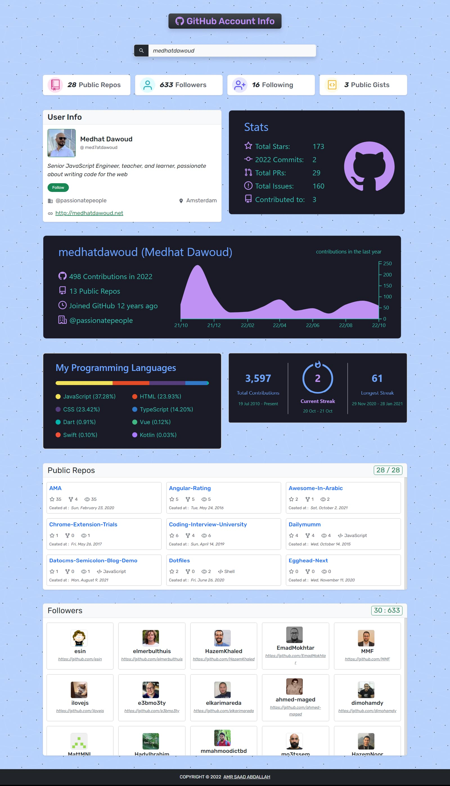
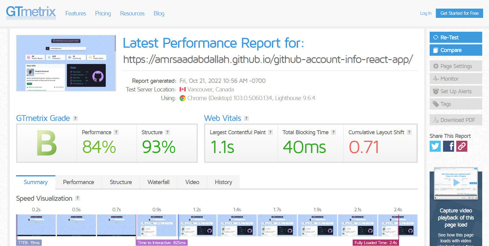

<h1 align="center" >Github Account Info &mdash; React App</h1>

### 👁️ Project Preview:

- [ Live Preview 👉 https://amrsaadabdallah.github.io/github-account-info-react-app](https://amrsaadabdallah.github.io/github-account-info-react-app)

- [ Github Repo 👉 https://github.com/amrsaadabdallah/my-github-account-info-react-app](https://github.com/amrsaadabdallah/my-github-account-info-react-app)
    - 🚩 It's a private repo <a target="_blank" href="mailto:amrsaadabdallah@gmail.com">contact me </a>to see.

---

### 📝 Project Description & features:

- It's a medium react app (Github Account Info) used to practice react features.

- I use [GitHub REST API](https://docs.github.com/en/rest) to get public informations for any github user account.

    - [First API URL](https://docs.github.com/en/rest/users/users#get-a-user) (`https://api.github.com/users/${accountName}`) => used to fetch personal information about the entered account name.

    - [Second API URL](https://docs.github.com/en/rest/users/followers#list-followers-of-a-user) (`https://api.github.com/users/${accountName}/followers?per_page=${perPage}&page=${pageNumber}`) => used to fetch followers of the entered account name.

    - [Third API URL](https://docs.github.com/en/rest/repos/repos#list-public-repositories) (`https://api.github.com/users/${accountName}/repos?per_page=${perPage}&page=${pageNumber}`) => used to fetch information about public repos of the entered account name.

- I use [GitHub Profile Summary Cards](https://github-profile-summary-cards.vercel.app/demo.html) to get graphs info about github account.

- When page load it's fetch the github information about account "medhatdawoud".

- It's allowed to fetch public github information about any github aacount by entering it in the input field by default we request 30 followers & 30 repos if number of followers or repos more than that when scrolling inside each section will make request another 30 followers or repos.

- When page load it's fetch the github information about account "medhatdawoud" by using the first API Url, when scroll inside photos preview will fetch another photos.

---

### 🛠️ Project Tools:

1. Used Google Fonts.

1. Bootstrap Classes for styling.

1. ReactJS Library.

1. Axios is a stand-alone third party package that used for making HTTP requests to APIs.

1. [GitHub REST API](https://docs.github.com/en/rest) to get public informations for any github user account.

1. [GitHub Profile Summary Cards](https://github-profile-summary-cards.vercel.app/demo.html) used to get graphs info about github account.

1. PropTypes package for typechecking component props.

1. [profile-summary-for-github resource](https://profile-summary-for-github.com/search).

1. [GTmetrix](https://gtmetrix.com/) is an online tool for customers to easily test the performance of their webpages.

---

### :sparkles: Project Skills applied:

1. Create Multiple React Component.

1. Configuration react component by props.

1. Render List of items.

1. Apply Conditional Rendering.

1. Deal with form.

1. Deal with Context API.

1. Fetching Dtat from APIs.

1. Use React Hook (UseContext, UseReducer, UseState, useEffect).

1. Ability to another page photos by using [infinite scroll](https://blog.saeloun.com/2022/07/08/react-custom-infinite-scroll-with-pagination.html).

1. Typechecking component props With PropTypes package.

1. Test the performance of the webpage after deploy by using [GTmetrix](https://gtmetrix.com/).

---

### 🧪 Project performance test:

Test the performance of the webpage after deploy by using [GTmetrix](https://gtmetrix.com/).

---

### 👋 Get In Touch:

- [🌐 Website 👉 https://amrsaadabdallah.github.io](https://amrsaadabdallah.github.io)
- [👔 LinkedIn 👉 https://www.linkedin.com/in/amrsaadabdallah](https://www.linkedin.com/in/amrsaadabdallah)
- [🌟 Github 👉 https://github.com/amrsaadabdallah](https://github.com/amrsaadabdallah)
- [📧 Gmail 👉 amrsaadabdallah@gmail.com](mailto:amrsaadabdallah@gmail.com)
- [🐤 Twitter 👉 https://twitter.com/amrsaadabdallah](https://twitter.com/amrsaadabdallah)
- [:phone: Whatsapp 👉 (+20) 109-775-6067](https://api.whatsapp.com/send/?phone=%2B2001097756067&text&type=phone_number&app_absent=0)

---

<a target="_blank" href="https://amrsaadabdallah.github.io">

 2022 &copy; Amr Saad Abdallah 

</a>

